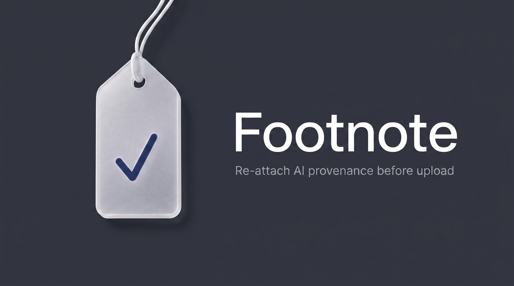

# Footnote

Re-attach **C2PA provenance** to AI-generated images so platforms like **X (Twitter)** can show the **“✨ Made with AI”** label again — after Photoshop, upscaling, or other tools strip the original tag.

Photoshop やアップスケールなどで「AIで生成」タグが外れた画像に、**アップロード直前**へ標準形式の C2PA 来歴を付け直す macOS 用の小さな道具です（ドロップレット + CLI）。出力名は `sample_ai.jpg` のように短い `_ai` サフィックス。

> **EN:** Honest disclosure only. For images you actually made with AI. Not for faking labels on photos that are not AI-generated.  
> **JA:** 誠実な自己申告専用。実際に AI で作った画像向け。実写などへの偽装用途ではありません。

<p align="center">
  
</p>

## Why / なぜ

Finishing passes (retouch, upscale, re-export) often drop embedded AI provenance. Footnote writes a standard C2PA manifest (`c2pa.created` + IPTC `trainedAlgorithmicMedia`) so you can declare that honestly **right before upload**.

仕上げ工程で埋め込み来歴が消えることがあるので、X などで「✨AIで生成」が再び点灯する標準形式を、アップ直前に自己申告として書き込みます。
## Requirements (macOS)

- [Homebrew](https://brew.sh)
- `brew install c2patool`

## Quick start

### CLI

```bash
chmod +x Footnote.sh
./Footnote.sh path/to/image.jpg
# → path/to/image_ai.jpg  (original untouched)
```

### Drag & drop app

```bash
./scripts/build_macos_app.sh v003
./scripts/deploy_to_applications.sh   # optional: /Applications/Footnote.app
```

Then drop PNG/JPEG onto **Footnote** (Dock-friendly). Output: `basename_ai.ext` next to the original.

## Output naming

| Input | Output |
|-------|--------|
| `sample.jpg` | `sample_ai.jpg` |

Short `_ai` suffix for global readability.

## How it works (short)

X currently lights the AI label when a **valid C2PA** claim includes:

- action `c2pa.created`
- `digitalSourceType` = `trainedAlgorithmicMedia` (IPTC)

Issuer trust lists are **not** required for that UI (as of 2026-07-22 experiments). Footnote uses c2patool’s **test signing cert** (development / self-declaration). Platform rules may change.

## Project layout

| Path | Role |
|------|------|
| `Footnote_v003.sh` | Versioned source of truth |
| `Footnote.sh` | Stable CLI name (copy of current version) |
| `droplet_src_v003.applescript` | Droplet source (`path to me` → bundled script) |
| `Footnote.app` | Built droplet (script inside `Contents/Resources/`) |
| `assets/Footnote_icon.png` | App icon master (1024²) |
| `assets/Footnote.icns` | macOS icon (applied as `droplet.icns` on build) |
| `assets/Footnote_social_16x9.png` | GitHub / OG link card (16:9, Nano Banana Pro) |
| `assets/Footnote_social_1280x640.png` | GitHub Social Preview upload (1280×640) |
| `.github/social-preview.png` | Same 1280×640 copy for discoverability |
| `scripts/build_macos_app.sh` | Build versioned + stable `.app` (+ icon) |
| `scripts/deploy_to_applications.sh` | Overwrite `/Applications/Footnote.app` |

## Disclaimer

- Use only on content you are allowed to mark as AI-generated.
- Does not copy OpenAI/Adobe/etc. signatures; it adds a **self-declared** C2PA claim.
- Extension must match real format (JPEG bytes named `.png` will fail).

## License

MIT — see [LICENSE](LICENSE).

## Credit

Built by [sirop](https://github.com/sirop-d) for personal workflow; shared so others can reuse or fork.
